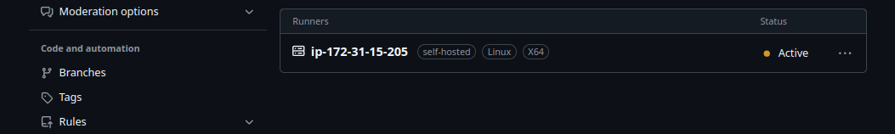
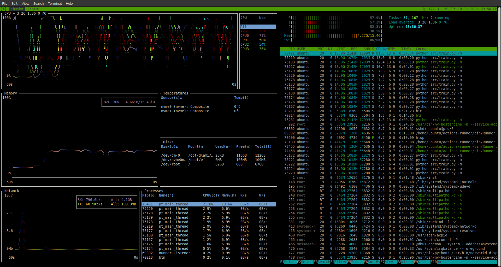
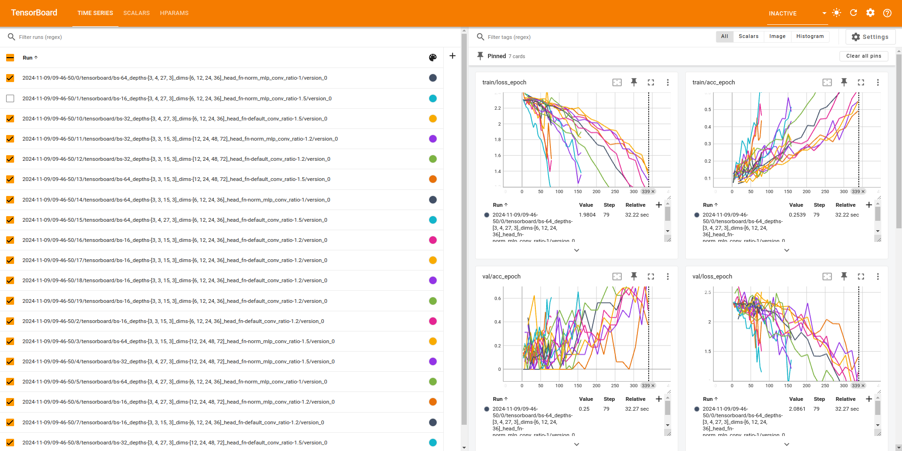
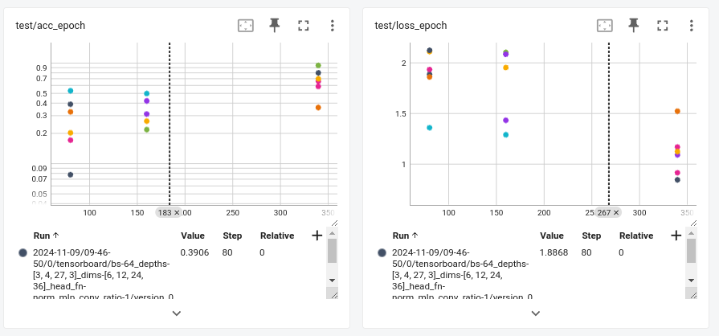
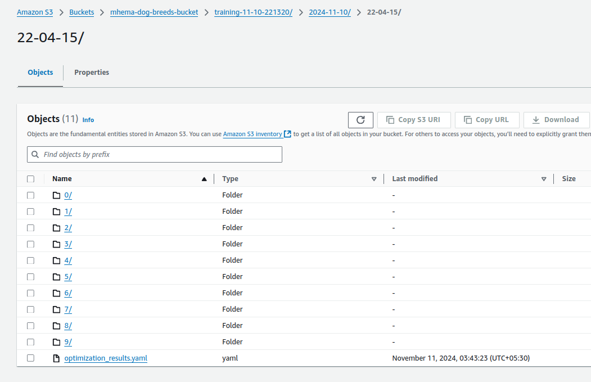
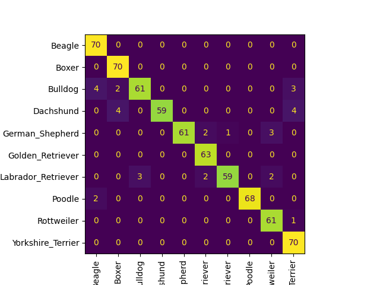
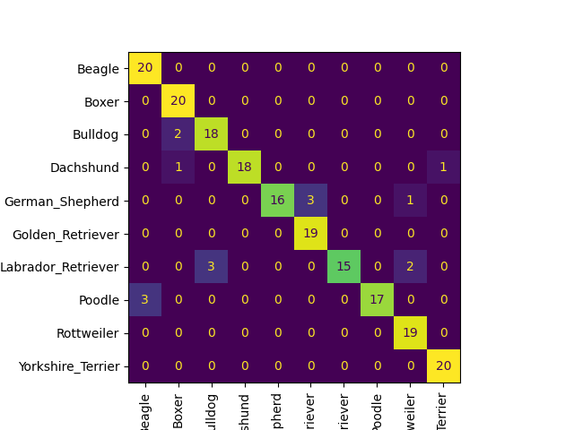
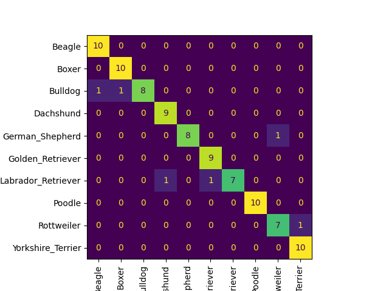
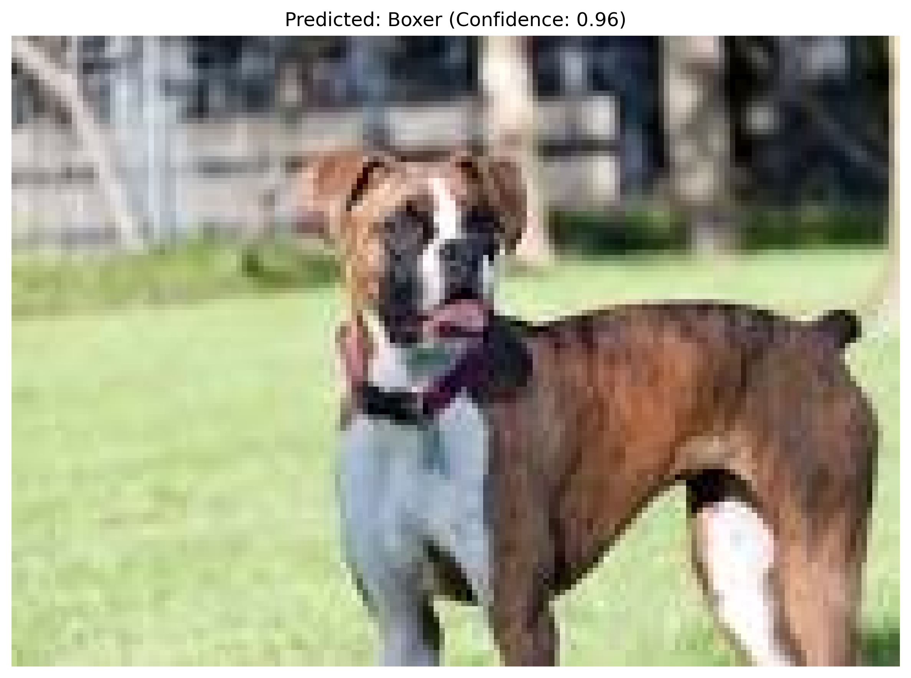

# DogsBreedsClassifier

<!-- To check GitHub Workflow Keep thing simple -->
<!-- max_epoch=5 and n_trails=2 -->

## WORKFLows
- [](https://github.com/Muthukamalan/DogsBreedsClassifier/actions/workflows/ci-train.yml)
- [](https://github.com/Muthukamalan/DogsBreedsClassifier/actions/workflows/ci-eval.yml)
- [](https://github.com/Muthukamalan/DogsBreedsClassifier/actions/workflows/ci-infer.yml)
## Data Setup
```.env
AWS_ACCESS_KEY_ID= 
AWS_SECRET_ACCESS_KEY=
DOCKER_USERNAME=
DOCKER_PASSWORD=
```
# Runner-Setup
<div align='center'> </div>


## Clean 
```sh
make trash
```


## Training

#### fastrun
training simple model
```sh
make fastrun
make sshow
```

### Hparms:: Optuna
<div align='center'> </div>

##### Loss & Accuracy Curves
- Train DataLoader
- Val DataLoader
<div align='center'> </div>
- Test DataLoader
<div align='center'> </div>

#### LearningRate


### Artifacts in S3 🪣
<div align='center'> </div>


## Test- PyTest
```sh
make test

============================================================================== test session starts ==============================================================================
platform linux -- Python 3.11.9, pytest-8.3.3, pluggy-1.5.0
rootdir: /home/muthu/GitHub/DogBreedsClassifier
configfile: pytest.ini
plugins: cov-5.0.0, anyio-3.7.1, time-machine-2.15.0, hydra-core-1.3.2
collected 6 items                                                                                                                                                               

tests/datamodules/test_dogs_datamodule.py ...                                                                                                                             [ 50%]
tests/models/test_dogs_classifier.py .                                                                                                                                    [ 66%]
tests/test_eval.py .                                                                                                                                                      [ 83%]
tests/test_train.py .                                                                                                                                                     [100%]
=========================================================================================== warnings summary ============================================================================================
../../miniconda3/envs/venv/lib/python3.11/site-packages/jupyter_client/connect.py:22
  /home/muthu/miniconda3/envs/venv/lib/python3.11/site-packages/jupyter_client/connect.py:22: DeprecationWarning: Jupyter is migrating its paths to use standard platformdirs
  given by the platformdirs library.  To remove this warning and
  see the appropriate new directories, set the environment variable
  `JUPYTER_PLATFORM_DIRS=1` and then run `jupyter --paths`.
  The use of platformdirs will be the default in `jupyter_core` v6
    from jupyter_core.paths import jupyter_data_dir, jupyter_runtime_dir, secure_write

tests/test_eval.py::test_catdog_ex_testing
tests/test_train.py::test_catdog_ex_training
  /home/muthu/miniconda3/envs/venv/lib/python3.11/site-packages/lightning/fabric/connector.py:571: `precision=16` is supported for historical reasons but its usage is discouraged. Please set your precision to 16-mixed instead!

tests/test_train.py::test_catdog_ex_training
  /home/muthu/miniconda3/envs/venv/lib/python3.11/site-packages/lightning/pytorch/loops/fit_loop.py:298: The number of training batches (8) is smaller than the logging interval Trainer(log_every_n_steps=50). Set a lower value for log_every_n_steps if you want to see logs for the training epoch.

tests/test_train.py::test_catdog_ex_training
  /home/muthu/miniconda3/envs/venv/lib/python3.11/site-packages/torch/optim/lr_scheduler.py:224: UserWarning: Detected call of `lr_scheduler.step()` before `optimizer.step()`. In PyTorch 1.1.0 and later, you should call them in the opposite order: `optimizer.step()` before `lr_scheduler.step()`.  Failure to do this will result in PyTorch skipping the first value of the learning rate schedule. See more details at https://pytorch.org/docs/stable/optim.html#how-to-adjust-learning-rate
    warnings.warn(

-- Docs: https://docs.pytest.org/en/stable/how-to/capture-warnings.html
=========================================================================================== warnings summary ============================================================================================
../../miniconda3/envs/venv/lib/python3.11/site-packages/jupyter_client/connect.py:22
  /home/muthu/miniconda3/envs/venv/lib/python3.11/site-packages/jupyter_client/connect.py:22: DeprecationWarning: Jupyter is migrating its paths to use standard platformdirs
  given by the platformdirs library.  To remove this warning and
  see the appropriate new directories, set the environment variable
  `JUPYTER_PLATFORM_DIRS=1` and then run `jupyter --paths`.
  The use of platformdirs will be the default in `jupyter_core` v6
    from jupyter_core.paths import jupyter_data_dir, jupyter_runtime_dir, secure_write

tests/test_eval.py::test_catdog_ex_testing
tests/test_train.py::test_catdog_ex_training
  /home/muthu/miniconda3/envs/venv/lib/python3.11/site-packages/lightning/fabric/connector.py:571: `precision=16` is supported for historical reasons but its usage is discouraged. Please set your precision to 16-mixed instead!

tests/test_train.py::test_catdog_ex_training
  /home/muthu/miniconda3/envs/venv/lib/python3.11/site-packages/lightning/pytorch/loops/fit_loop.py:298: The number of training batches (8) is smaller than the logging interval Trainer(log_every_n_steps=50). Set a lower value for log_every_n_steps if you want to see logs for the training epoch.

tests/test_train.py::test_catdog_ex_training
  /home/muthu/miniconda3/envs/venv/lib/python3.11/site-packages/torch/optim/lr_scheduler.py:224: UserWarning: Detected call of `lr_scheduler.step()` before `optimizer.step()`. In PyTorch 1.1.0 and later, you should call them in the opposite order: `optimizer.step()` before `lr_scheduler.step()`.  Failure to do this will result in PyTorch skipping the first value of the learning rate schedule. See more details at https://pytorch.org/docs/stable/optim.html#how-to-adjust-learning-rate
    warnings.warn(

-- Docs: https://docs.pytest.org/en/stable/how-to/capture-warnings.html
==================================================================================== 6 passed, 5 warnings in 33.11s =====================================================================================
```


## Eval
#### confusion matrix
- Train DataLoader
<div align='center'> </div>

- Val DataLoader
<div align='center'> </div>

- Test DataLoader
<div align='center'> </div>

## prediction
```
args:
    --input_folder
    --output_folder # where to save
    --ckpt_path
```
<div style="display: flex; justify-content: center;">
    
    
</div>


## Clean
```sh
make trash
```


## Inference

```log
2024-11-10 20:22:17 | INFO     | utils.logging_utils:wrapper:22 - Starting load_image
2024-11-10 20:22:17 | INFO     | utils.logging_utils:wrapper:25 - Finished load_image
2024-11-10 20:22:17 | INFO     | utils.logging_utils:wrapper:22 - Starting infer
2024-11-10 20:22:17 | INFO     | utils.logging_utils:wrapper:25 - Finished infer
2024-11-10 20:22:17 | INFO     | utils.logging_utils:wrapper:22 - Starting save_prediction_image
2024-11-10 20:22:17 | INFO     | utils.logging_utils:wrapper:25 - Finished save_prediction_image
<class 'omegaconf.listconfig.ListConfig'> "conv_ratio":         1.2
"depths":             [3, 3, 15, 3]
2024-11-10 20:22:17 | INFO     | utils.logging_utils:wrapper:22 - Starting load_image
"dims":               [6, 12, 24, 36]
"head_fn":            default
"in_chans":           3
"lr":                 0.001
"min_lr":             1e-06
"model_name":         Mamba
"num_classes":        10
"pretrained":         False
"scheduler_factor":   0.1
"scheduler_patience": 5
"trainable":          False
"weight_decay":       1e-05
Processed guess2.jpg: Poodle (0.89)
2024-11-10 20:22:17 | INFO     | utils.logging_utils:wrapper:25 - Finished load_image
2024-11-10 20:22:17 | INFO     | utils.logging_utils:wrapper:22 - Starting infer
2024-11-10 20:22:17 | INFO     | utils.logging_utils:wrapper:25 - Finished infer
2024-11-10 20:22:17 | INFO     | utils.logging_utils:wrapper:22 - Starting save_prediction_image
2024-11-10 20:22:17 | INFO     | utils.logging_utils:wrapper:25 - Finished save_prediction_image
Processed guess1.jpg: Boxer (0.96)
2024-11-10 20:22:17 | INFO     | utils.logging_utils:wrapper:25 - Finished main
```

- **collab**
    - @abhiya🩺
    - @mhema 🧘‍♀️
    - @muthu 🤾‍♂️
